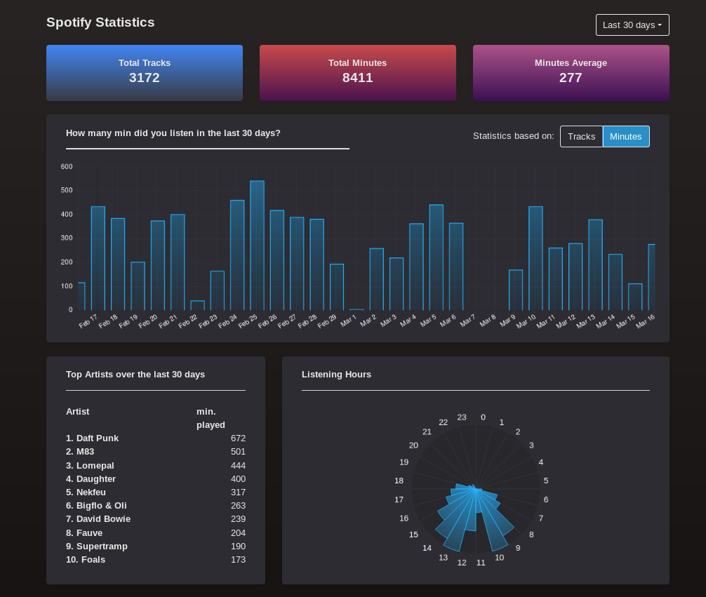

## Spotlight

Spotlight is a Spotify dashboard that allows user to visualize his listening habits. The following metrics are available, over the last 3/6/12 months:

* Total number of tracks listened.
* Total minutes listend.
* Average daily minutes listend.
* Graph of the daily tracks / minutes listened.
* List of favorites artists (most listened).
* Listening clock, displaying at which hour of the day the user listens music the most.


The backend API of this application is built using [Python](https://www.python.org/) and served by a [Flask](https://flask.palletsprojects.com/en/1.1.x/) web server. This server uses *.json* streamings files that the user can download on his Spotify's profile. This list of streaming is then converted in a dataframe, processed with [Pandas](https://pandas.pydata.org/).

The frontend part is made with [React](https://en.reactjs.org/) and [Bootstrap](https://getbootstrap.com/). The graphs are made with [Chart.js](https://www.chartjs.org/) library.

### Usage

- Copy you Spotify data in the `̀backend/MyData/` folder.
- Start the local Flask's server by running the `backend/app.py` python script.
- Connect to `localhost:5000` to acess the dashboard.


### Folders structure
```
.
├── backend
│   ├── build
│   │   └── static
│   │       ├── css
│   │       └── js
│   └── MyData
└── frontend
    └── spotlight
        ├── public
        └── src
            ├── components
            │   ├── Charts
            │   ├── List
            │   ├── NavBar
            │   └── Recap
            ├── containers
            └── views
                └── Dashboard

18 directories
```
